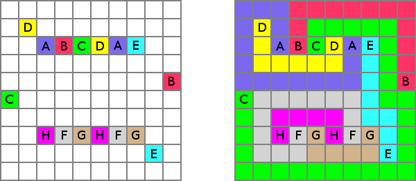

# LINGI2261 - Artificial intelligence

## Assignment 1: Numberlink

In this task, you have to develop a depth first search solver for the Numberlink problem. The Numberlink problem initially consists of a grid with some cells labeled while the remaining cells are empty. The goal of this problem is create disjoint paths connecting cells with identical labels. Each label appears exacly twice. The path connecting them must start from one of those cells and end at the other. An example is shown bellow. In the picture, the labels are letters and the white cells are empty. On the left we can see an example of initial state and on the right we have the final state. It is considered that an instance is well-designed if it has a unique solution. In this assignment we consider only well-designed instances. An online version of the game can be found at:

http://www.lsrhs.net/faculty/seth/Puzzles/numberLink/numberLink.html



We use alphabet letters as labels instead of numbers. Any labels will always be an upper case letter from 'A' to 'Z' and the labels will be consecutive, meaning that if for instance we use label 'D' then labels 'A', 'B' and 'C' are also used. The empty positions are represented with the character 'textbf{.}'. There are no spaces in the input file. Your program should write a solution to the standard output. The solution is composed of the successive states to reach the goal separated by an empty line. The format of the successive states is the same as the one in the problem files. As example of the format of the solutions, the first two states of the solution to the problem level6s.in might be:

```
.D.BDC
.E....
......
.EB..A
....C.
A.....

.D.BDC
.E....
.E....
.EB..A
....C.
A.....
```

Note that the initial state is represented in the solution. The final state must also be represented. It is important to respect this format since your program will be automatically graded. The good point is that you can submit as many versions as you desire and you have a direct feedback on its performances.

You should complete one path at a time. This means that your state has to maintain the current path under construction and the position of the last extension. Your successors should consist of extentending the last position Down, Up, Left and Right, in that order. Then next figure shows a state and its successors. When starting a new path, you can start in any of its two endpoints.

You will implement at least one class Numberlink(Problem) that extends the class Problem such that you will be able to use search algorithms of AIMA. A small template numberlink.py is provided in the resources for this problem. In this file you will find a method pathExists that takes as input a matrix of characters grid and two positions (i1, j1) and (i1, j1) and outputs wherever of not there exists a path bewtween those positions that consits only of empty cells (cells with character '.'). You are not forced to use it. Before diving into the code, we recommend you to first have a look at the questions below that need to be answered in your written report.

Your solution should take the path to a file containing the instance to solve as only argument and print to the standard output (function print() in python3) the solution respecting the format given below. The time limit to solve all the instances (24 instances) is 500 seconds and the maximum memory usage to solve any instance is 1Gb.

## Assignment 2: Sokoban

The problem you will solve for this assignment is the Sokoban planning problem. Again, the search procedures from aima-python3 will help you implement the problem! The Sokoban problem is the following. A person is in a 2d grid maze environment with walls on some positions. This person can potentially move in the 4 directions (up,right,down,left). In the initial state, some positions contain blocks and as many other positions are labeled as target positions for blocks. Blocks can be pushed one at a time in the moving direction of the person. The objective is to reach a final state where every block lies in a target position.

You can train yourself at:

http://www.joriswit.nl/sokoban/flash/

If you find this easy, take a look at the benchmarks: the last instances are much more difficult!

A solution to this problem is composed of the successive states of the game that end up with each box on a target position. The three last states of a solution file for the instance 01 are represented below. Each state is represented using the same format as the input and separated from the others with an empty line. The target positions should not be represented in the printed states. The avatar can move only from one position to an adjacent one between two successive states in the solution file (of course it can be different in your model but not in the solution file).

Your solution should take the path to a file containing the name of the instance to solve as only argument. With this name you should read the files .init and .goal to retreive the initial state and the goal. For instance given the file "puzzle1" you should read from files "puzzle1.init" and "puzzle1.goal". The time limit to solve all the instances is 1000 seconds and the maximum memory usage to solve any instance is 1Gb.

## Assignment 3: Avalam

This task consists in developing an advanced agent for the Avalam game. You have to upload a zip archive with the following files at its root.

* `avalam.py`: module containing the board representation, the agent interface and some useful methods. You can use your modified version of the framework provided on the Moodle page of the course.
* `minimax.py`: implementation of the MiniMax and Alpha-Beta algorithms. You can use your modified version of the framework provided on the Moodle page of the course.
* `super_agent.py`: your implementation of an advanced alpha-beta agent. Answer the questions of the assignment to get insight of good practice and winning strategies before you actually implement it.

## Assignment 4.1: Wedding problem

A big wedding with n guests is being organized and they are having trouble choosing the tables that should be assigned to each guest. There is a total of t tables (t divides n) and we know the affinities bewtween the guests. The goal is to find a layout that maximizes the total affinity.

More formally, the affinity between each pair of guests is given in a n by n matrix A. The affinities are integer values. A negative value in cell A[i][j] means that person i dislikes person j. A zero value means that person i is indifferent to person j and a positive affinity means that person i likes person j. Note that we do not assume affinities to be symmetric, that is, we can have A[i][j] != A[j][i]. The values in the diagonal have no meaning and are set to 0.

This task consists in the development of a local search choosing the best node (i.e., the node with maximum value) in the neighborhood, even if it degrades the current solution. This solver must be implemented in the function maxvalue(problem, limit=100, callback=None) given in the template. You can get inspiration for the code in the function randomwalk inside search.py.

## Assignment 4.2: RPG equipment problem

The RPG Equipment Problem is the following problem. Let us assume you are playing a Role Playing Game (RPG) in which you have to reach a treasure at the top of a dungeon. To climb to the last floor of the dungeon, you have to go through a succession of levels. Each level contains a succession of enemies you have to defeat to reach the next level. Each enemy can only be defeated by your character if he has a given set of abilities. At the beginning of each level, a merchant sells pieces of equipment to your character. To each piece of equipment corresponds a set of abilities (some abilities can be provided by several pieces of equipment). Each piece of equipment presents exactly one three-way conflict. A conflict (equ1, equ2, equ3) is such that buying two (or less) of these equipment pieces is allowed (buying (equ1, equ2), (equ1, equ3), (equ2, equ3), (equ1), (equ2) or (equ3) is allowed) but you cannot buy the three (buying (equ1, equ2, equ3) is not allowed).

Let us assume you have played the game for a long time before and your character has a huge amount of coins in his possession such that you are not limited by the amount of money when considering the purchase of equipment pieces. Let us also assume at the beginning of each level that the equipment purchased on the previous level is broken and cannot be used anymore (i.e. at the beginning of each level, the player begins with no equipment). The relations between the equipment pieces, abilities and enemies are the following ones:

* __Provides__: when piece of equipment E provides ability A, if the player buys piece of equipment E he possesses the ability A.
* __IsProvided__: when ability A is required to beat the level, the player has to buy at least an equipment E such that ability A is provided by equipment E (an ability can be provided by several pieces of equipment).
* __Conflicts__: when pieces of equipment E1 and E2 are in conflict, the player cannot buy both pieces together. However, the player is allowed to buy one or zero of these equipment pieces.
* __Requires__: when enemy M requires the ability A, the player has to possess ability A to defeat enemy M.

This task consists in the development of a minimal SAT resolver for the RPG Equipment Problem. Given a level (i.e. a collection of enemies) and a merchant (i.e. a collection of pieces of equipment), the problem consists in finding a set of pieces of equipment the player has to buy to the merchant to be able to defeat all the enemies from the level. For this task, we will only search for a satisfying set without bothering about its size. The player can of course possess some unneeded abilities.
